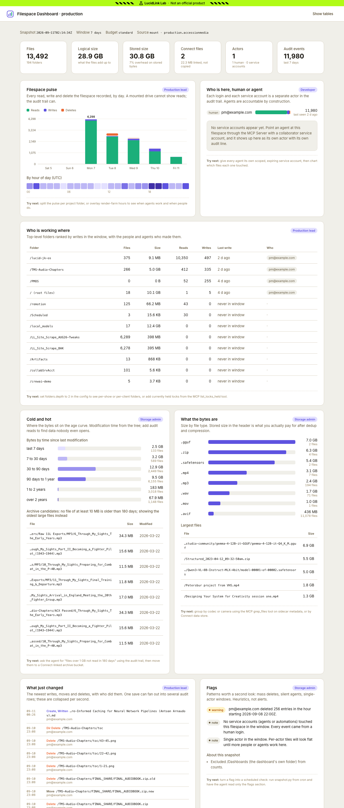

# LucidLink filespace dashboard skill

An agent skill that builds a shareable dashboard for a LucidLink filespace and
places it inside the filespace, so everyone with the drive mounted sees the same
page. Works in Claude Code, Codex and any harness that reads the open
`SKILL.md` format.

**Status: LucidLink Lab prototype.** Not an official product. Built to show what
the audit trail and the MCP Server make possible, and to be customized from
there.



## What you get

One `index.html`, no server and no build step, plus the `snapshot.json` it was
rendered from. Tiles, each tagged with the persona it serves:

| Tile | Persona | What only LucidLink can show here |
|---|---|---|
| Filespace pulse | Production lead | reads as well as writes, per day, with an hourly profile |
| Who is here, human or agent | Developer | service accounts as separate, accountable actors |
| Who is working where | Production lead | writers per folder from the audit trail |
| Cold and hot | Storage admin | bytes on the age curve, archive candidates |
| What the bytes are | Storage admin | size by type, stored versus logical size |
| What just changed | Production lead | newest writes, moves, deletes with actor, fan-out collapsed |
| Flags | Storage admin | mass deletes, silent agents, single-actor windows |

## Install the skill

The repo is private while this is a prototype. You need read access to it on
GitHub, and git on your machine needs to be able to clone private repos
(`gh auth setup-git` once, or an SSH key).

Claude Code, as a plugin (recommended, gets updates):

```
/plugin marketplace add jkatinger/lucidlink-filespace-dashboard
/plugin install lucidlink-filespace-dashboard@jkatinger-lab
```

Or from a shell:

```bash
claude plugin marketplace add jkatinger/lucidlink-filespace-dashboard
claude plugin install lucidlink-filespace-dashboard@jkatinger-lab
```

Later, `/plugin marketplace update jkatinger-lab` pulls the newest version.

Claude Code, as a personal skill (no plugin system):

```bash
git clone git@github.com:jkatinger/lucidlink-filespace-dashboard.git ~/.claude/skills/lucidlink-filespace-dashboard
```

Codex (the ChatGPT desktop app or the `codex` CLI):

```bash
git clone git@github.com:jkatinger/lucidlink-filespace-dashboard.git ~/.codex/skills/lucidlink-filespace-dashboard
```

Then ask your agent for a dashboard of a filespace. It runs the three-question
interview in `SKILL.md`, collects a snapshot, renders the page, and tells you
where it put it.

## Run the scripts yourself

No agent needed. Python 3.10 or newer, standard library only for a mounted
filespace.

```bash
cp config.example.yaml config.yaml          # edit filespace.root and output.publish_to
python3 scripts/snapshot.py --config config.yaml --budget standard
python3 scripts/render.py --snapshot out/snapshot.json --publish "/Volumes/<workspace>/<filespace>/Dashboards/<name>"
```

Schedule those two lines with cron, launchd or Task Scheduler and the dashboard
refreshes with zero agent tokens.

## Sources

| `filespace.source` | Needs | Stored size | Notes |
|---|---|---|---|
| `mount` | the filespace mounted locally | no, pass `--stats` with `data_bytes` and `storage_bytes` from the MCP `filespace_stats` tool | fastest; reads metadata and `/.lucid_audit` only |
| `sdk` | `pip install lucidlink` and a service-account token in `$LUCIDLINK_TOKEN` | yes | written against SDK 0.14.0 signatures, not yet exercised end to end |
| `mcp` | the LucidLink MCP Server in your agent | yes | the agent builds `snapshot.json` by hand following `references/mcp-recipe.md` |

## Budgets

| Budget | Walk | Audit window | Extras | Rough MCP cost |
|---|---|---|---|---|
| `lite` | 3,000 entries or 30 s | 7 days | none | about 5 calls |
| `standard` | 40,000 entries or 2 min | 7 days | hourly profile, flags | 20 to 40 calls |
| `deep` | 400,000 entries or 15 min | 30 days | everything | 100 or more |

## Limits, stated plainly

- The audit trail must be enabled by a filespace admin. Only events after that point exist.
- A snapshot is a point in time. Refresh by rerunning or by scheduling the scripts.
- Large filespaces are sampled once the walk budget is hit. The page says so under Flags.
- One save in a desktop app can produce several audit rows. The ticker collapses them per second; the pulse counts raw rows.
- There is no hosted URL for filespace content. Open the page from the mounted drive or serve the folder locally.
- Anyone could build this on S3 plus a log pipeline. Here it is zero setup because the audit trail and the shared namespace already exist.

## Repository layout

```
SKILL.md                  the skill: interview, procedure, guardrails
config.example.yaml       every option, commented
scripts/snapshot.py       collector: mount or sdk source, three budgets
scripts/render.py         embeds snapshot.json into the template, publishes, keeps history
templates/dashboard.html  the page: LucidLink Lab style, dependency-free charts
references/               mcp-recipe, snapshot-schema, tile-catalog, customizing, limits
examples/production/      a real snapshot and screenshot from a 29 GB filespace
```

## License

To be decided by LucidLink before public release.
